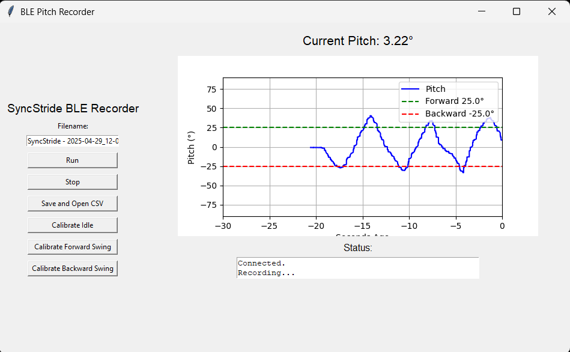

# SyncStride: Wearable Gait Biofeedback Device

## Overview

SyncStride is a wrist-mounted wearable designed for individuals with Parkinson’s Disease. It detects asymmetric arm swing in real-time and provides vibrotactile cues to encourage symmetrical gait patterns—helping reduce fall risk and improve mobility.

## Features

- Real-time IMU-based arm swing detection
- Vibrotactile and auditory feedback for movement correction
- BLE interface with Python GUI for live data and calibration
- Logs motion data to CSV for clinical analysis
- Ergonomic, lightweight, and adjustable for long-term use

## Hardware

- Nicla Sense ME microcontroller
- 6-axis IMU
- Vibration motor
- Rechargeable battery (>4h runtime)
- BLE module

## GUI Alerts

- Device connected/disconnected
- Calibration (idle, forward, backward)
- Data saved to CSV
- Real-time pitch plotting

## Testing Highlights

- Feedback latency: <1s
- Detection accuracy: ±5° arm swing
- BLE range: ~20 ft
- Battery life: 4+ hrs
- Comfortable for extended wear

## Contributors

- [@MGross21](https://github.com/MGross21)
- Glen Stevens
- Jonathan Hernandez
